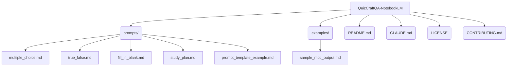

# QuizCraftQA-NotebookLM

Manual workflow for generating high-quality ISTQB exam questions using [Google NotebookLM](https://notebooklm.google.com).

## Overview
This repository provides:
- Prompt templates for different ISTQB question types (MCQ, True/False, Fill-in-the-blank, Study Plan)
- Step-by-step guide for using NotebookLM with official ISTQB syllabus PDFs
- Example outputs for reference

## Quick Start
1. Go to [notebooklm.google.com](https://notebooklm.google.com)
2. Create a new notebook
3. Upload ISTQB syllabus PDFs from [QuizCraftQA](https://github.com/SUDARSHANCHAUDHARI/QuizCraftQA/tree/main/ISTQB)
4. Copy a prompt from [`prompts/`](prompts/) and paste into NotebookLM
5. Save good outputs to [`examples/`](examples/)

## Recommended PDFs
| PDF | Level |
|-----|-------|
| ISTQB_CTFL_Syllabus_v4.0.1.pdf | Foundation *(start here)* |
| ISTQB-CTAL-TA-Syllabus-v4.0-EN.pdf | Advanced — Test Analyst |
| ISTQB_CTAL-TM_Syllabus_v3.0_ALL_.pdf | Advanced — Test Manager |

## Folder Structure

## FAQ & Troubleshooting

**Q: NotebookLM says it can't find the syllabus content?**
A: Make sure you have uploaded the correct PDF and selected it as a source in your NotebookLM notebook.

**Q: The generated questions are too simple or repetitive.**
A: Try specifying a more focused [CHAPTER/TOPIC] in your prompt, or experiment with different prompt variations.

**Q: How do I add my own prompt or example?**
A: See [CONTRIBUTING.md](CONTRIBUTING.md) for a template and instructions.

**Q: Can I use this for other certifications?**
A: Yes, but you will need to adapt the prompts to match the structure and style of the other syllabus.

## Contributing
See [CONTRIBUTING.md](CONTRIBUTING.md) for guidelines and a template for new prompts/examples.

## License
This project is licensed under the [MIT License](LICENSE).

## Feedback
Suggestions and improvements are welcome! Open an issue or pull request, or contact the maintainer.

## Related Projects
- [QuizCraftQA](https://github.com/SUDARSHANCHAUDHARI/QuizCraftQA) — Main web app
- [QuizCraftQA-AI](https://github.com/SUDARSHANCHAUDHARI/QuizCraftQA-AI) — Gemini API backend
